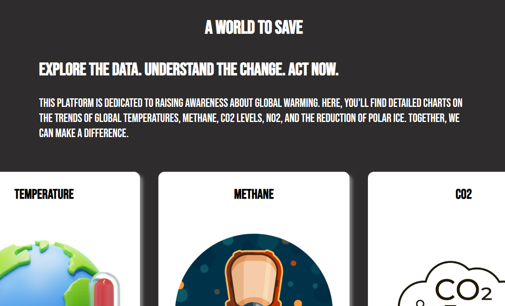

# Global Warming

You can try here the app: [Link](https://globallwarming.netlify.app)

## Description

This platform is dedicated to raising awareness about global
warming. Here, you'll find detailed charts on the trends of global
temperatures, methane, CO2 levels, NO2, and the reduction of polar
ice. Together, we can make a difference.

## Functionality

The app collects data from the [Global Warming API](https://global-warming.org/) and analyzes it to display detailed charts.

## :books: Lenguages and Tools

- HTML
- CSS
- Sass
- JavaScript
- Vite
- React
- React Hooks
- Custom Hooks
- React-router
- Axios
- Dotenv-webpack
- Recharts

## :e-mail: Contacts

Get in touch

- [Linkedin](https://www.linkedin.com/in/antonio-naccarella-31976725a/)
- E-mail: naccarellaantonio25@gmail.com
